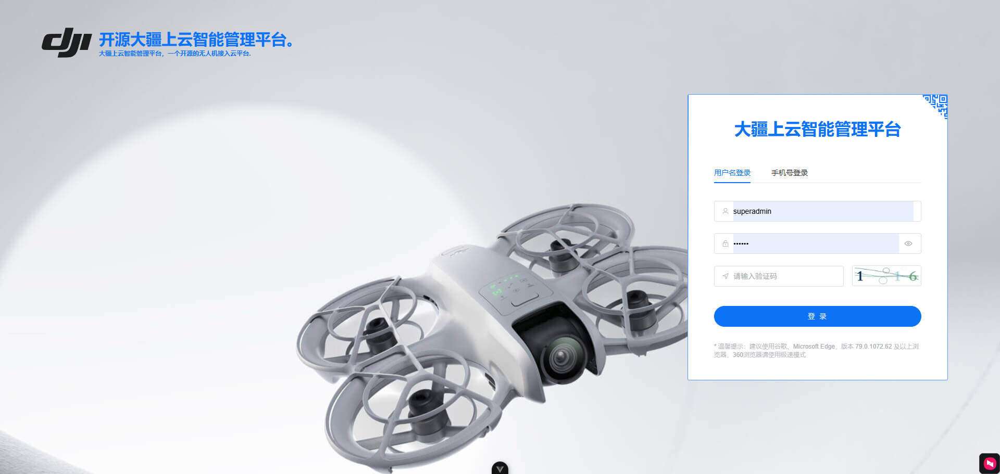
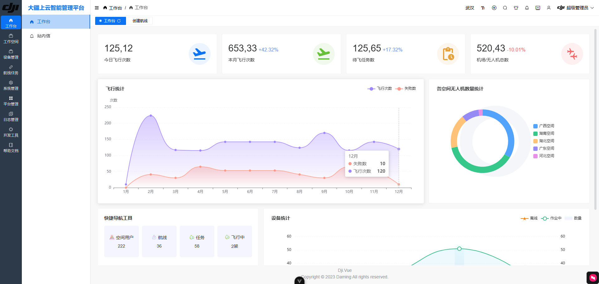
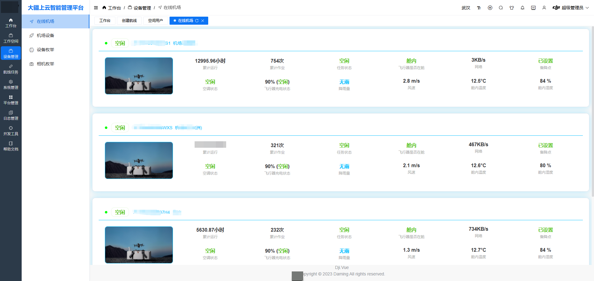
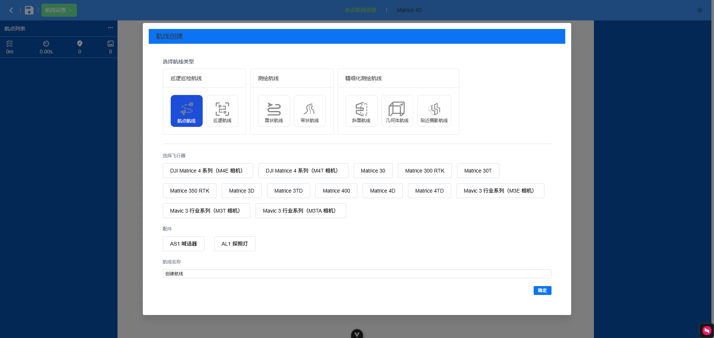
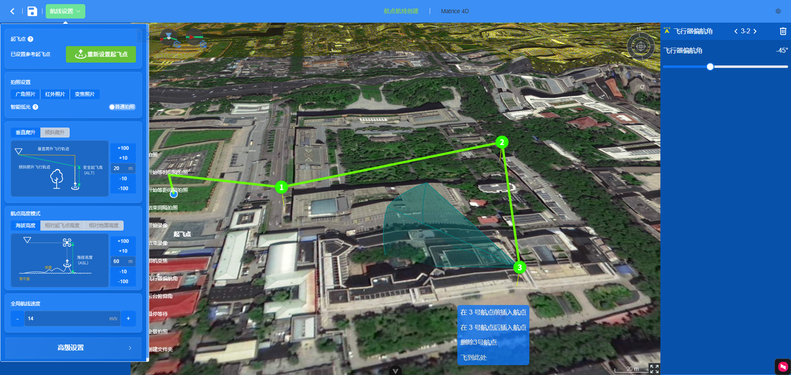
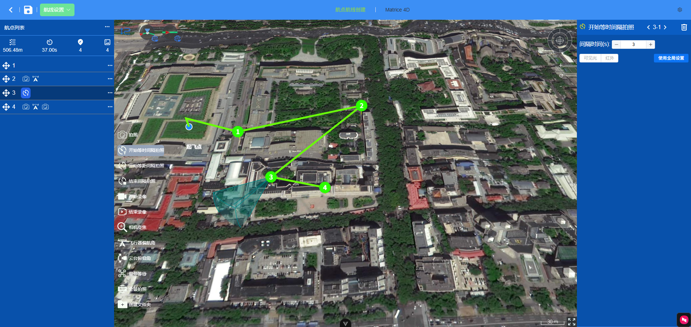
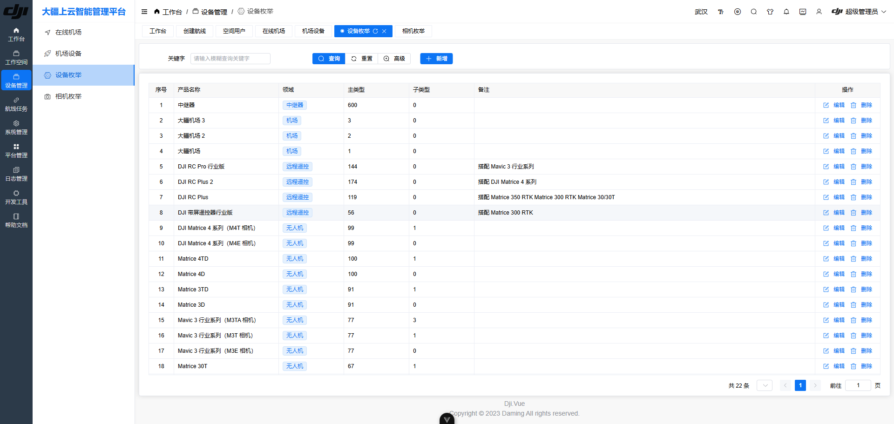
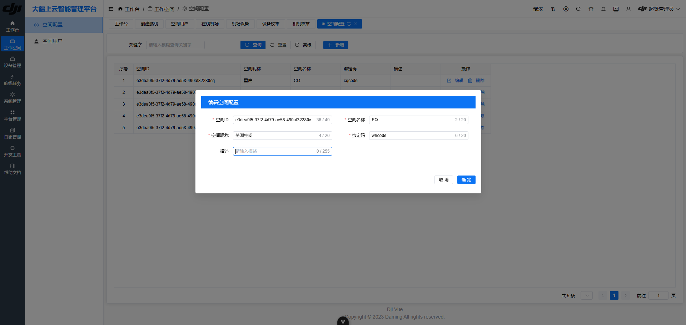
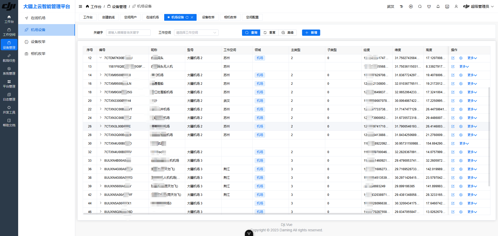

<div align="center">

# dji_vue

**大疆机场上云平台 · 后台运维管理端**

面向大疆机场 / 无人机的 Web 管理后台：设备台账、航线管理、飞行区绘制、直播
  
、告警与台账维护。通常与 [dji\_server](https://github.com/guipie/dji_server) 后端配套使用。

<p>


</p>

</div>

---

## 这是什么

大疆官方提供了上云 API，但服务端需要自己实现：

- **云司空 2** 闭源，无法二次开发
- 官方开源的 `Cloud-API-Demo` 已于 2025-04-10 停止维护，且只是协议演示、不落库、不上生产

`dji_vue` 是配套 [dji_server](https://github.com/guipie/dji_server) 的**后台运维管理端**，定位偏「管理」而非「实时指挥」：

- 偏**低频、重数据**：设备台账、文件台账、航线任务、告警记录、媒体文件
- 地图操作（飞行区 / 作业区绘制）走 **Cesium 三维**
- 实时性要求不高的场景（看当前状态、回放进度）走 HTTP 轮询 + SignalR 补充

> 如果你要的是**实时态势看板 / DRC 指令飞行 / 直播墙**，请看
>
> [dji-cloud-console](../dji-cloud-console)（Tauri 桌面 + 高德 + WebRTC）。

---

## 功能一览

| 模块       | 路径                                                    | 能力                             |
| -------- | ----------------------------------------------------- | ------------------------------ |
| 机场管理     | `views/main/djiDock`                                  | 机场台账、在线状态、指令下发（开舱 / 启停）        |
| 设备管理     | `views/main/djiDevice`                                | 无人机 / 遥控器台账与子设备挂载关系            |
| 设备字典     | `views/main/djiDeviceEnum`<br />`djiDeviceCameraEnum` | 机型 / 相机型号字典维护（22 种机型 + 48 种相机） |
| 在线设备     | `views/main/djiDeviceOnline`                          | 实时在线总览                         |
| **飞行区域** | `views/main/djiFlightArea`                            | **Cesium 三维绘制作业区 / 禁飞区**，见下方专节 |
| 航线管理     | `views/main/djiWayline`                               | 航线文件（WPML/KMZ）台账、任务下发与进度       |
| 直播       | `views/main/djiLive`                                  | 对接自建 SRS，flv.js / hls.js 拉流播放  |
| 媒体文件     | `views/main/djiMedia`                                 | 机场与无人机拍摄的媒体清单与下载               |
| HMS 告警   | `views/main/djiHms`                                   | 设备健康告警分级查看                     |
| 空域感知     | `views/main/djiAirSense`                              | 附近载人飞机告警                       |
| 远程日志     | `views/main/djiLog`                                   | 设备上报的日志文件清单与解析                 |
| OTA 升级   | `views/main/djiOta`                                   | 固件升级任务下发与结果                    |
| 工作空间     | `views/main/djiWorkspace`<br />`djiWorkspaceUser`     | 多租户空间与成员管理                     |

---

## 示例-飞行区域绘制

`views/main/djiFlightArea` 是最能体现本项目价值的部分 —— **在 Cesium 三维地球上直接画出作业区与禁飞区**，
  
并导出成 DJI 设备可以识别的格式。

| 能力     | 说明                                              |
| ------ | ----------------------------------------------- |
| 两种区域类型 | **作业区（dfence，圈内可飞）** / **禁飞区（nfz，圈外可飞）**        |
| 两种几何   | 多边形（3~255 顶点）与圆形（中心点 + 半径）                      |
| 三维绘制   | 左键逐点打个多边形，点「完成」闭合；圆形支持拖拽定半径                     |
| 量算     | 基于 `@turf/turf` 实时算面积 / 周长 / 顶点数                |
| 导入导出   | 导出 DJI 标准 `FeatureCollection`（GeoJSON），可直接进上云流程 |
| 后端校验   | 半径 ≥ 10m、顶点数、是否闭合、坐标范围 —— 违规逐条给出中文原因            |

相关实现：`src/utils/cesium/flyZone.ts`、`src/utils/cesium/index.ts`、后端
  
`DjiFlyZoneService`（提供 `exportDji` 接口生成设备侧格式）。

> **多内核切换注意**：Cesium 的 `viewer` 在全局复用。从其他 Cesium 页面跳到飞行区时，
>
> 若复用了绑定在已销毁容器上的旧 viewer，会得到一张空白地图。
>
> 当前实现按 `viewer.container === 当前容器元素` 判定，不一致就先销毁再重建。

---

## 技术选型

| 维度   | 选型                                 | 备注                         |
| ---- | ---------------------------------- | -------------------------- |
| 框架   | **Vue 3.5 + TypeScript 5.9**       | 组合式 API，`<script setup>`   |
| 构建   | **Vite 7**                         | 含 CDN 外链、gzip、devtools 插件  |
| UI   | **Element Plus 2.11** + **UnoCSS** | 组件库 + 原子化 CSS              |
| 状态   | **Pinia 3** + 持久化插件                | 登录态、偏好设置持久化                |
| 三维地图 | **Cesium 1.136**                   | 飞行区绘制、航线预览                 |
| 图表   | **ECharts 5.4** + echarts-gl + 词云  | 数据看板                       |
| 视频   | **flv.js** / **hls.js**            | 自建 SRS 拉流，低延迟用 HTTP-FLV    |
| 实时   | **@microsoft/signalr**             | 订阅后端 `publicclientmessage` |
| 加密   | **sm-crypto-v2**                   | 登录密码 SM2 国密加密              |
| 几何   | **@turf/turf**                     | 面积 / 周长量算                  |

---

## 目录结构

```
dji_vue/
├── .env / .env.development / .env.production   # 环境变量（三个都已入库）
├── src/
│   ├── api-services/         # 由后端 Swagger 自动生成的 TS SDK（含少量二开改动）
│   ├── api/main/             # 业务接口封装（按模块拆分）
│   ├── views/main/           # 业务页面
│   │   └── djiFlightArea/    #   飞行区绘制（Cesium）
│   ├── utils/
│   │   └── cesium/           #   Cesium 初始化、绘制、交互、飞行区、航线工具
│   ├── stores/               # Pinia store
│   ├── layout/ 、router/ 、theme/ 、i18n/
│   └── assets/
├── demos/                    # 效果截图
└── vite.config.ts            # 含 /api 代理到 VITE_API_URL
```

---

## 快速开始

### 环境要求

| 组件      | 版本                     |
| ------- | ---------------------- |
| Node.js | **18+**（建议 20 LTS 或更高） |
| 包管理器    | npm / pnpm / yarn 均可   |

### 安装启动

```bash
git clone https://github.com/guipie/dji_vue.git
cd dji_vue

npm install          # 或 pnpm install / yarn
npm run dev          # 默认 http://localhost:8888
```

打包与代码风格：

```bash
npm run build        # 产物在 dist/
npm run lint-fix     # ESLint 修复
```

### 连接后端

Vite 已配置 `/api` 代理，指向环境变量里的后端地址：

```bash
# .env.development
VITE_API_URL = http://localhost:5005
```

因此前端页面里**直接请求 `/api/xxx`** 即可，跨域由代理解决；生产环境用 Nginx 转发同样路径。

### 登录与 SM2 加密（重要）

后端要求登录密码**先用 SM2 公钥加密**再传输，公钥必须与后端一致：

```bash
# .env.development
VITE_SM2_PUBLIC_KEY = 04xxxxxxxx...(130 位十六进制)
```

取值来自后端 `Dji.Application/Configuration/App.json → Cryptogram.PublicKey`。

> ⚠️ **错配最难查的症状**：登录恒失败，服务端只报「账号或密码错误」，
>
> 没有任何线索指向密钥不匹配。如果换了部署环境，第一时间核对这一项。
>
> 生成方法见 [dji\_server README 的安全须知](https://github.com/guipie/dji_server/README.md#安全须知部署前必读)。

---

## 环境变量

| 变量                    | 说明                  | 默认值                     |
| --------------------- | ------------------- | ----------------------- |
| `VITE_PORT`           | 开发服务器端口             | `8888`                  |
| `VITE_OPEN`           | dev 时自动打开浏览器        | `false`                 |
| `VITE_API_URL`        | 后端地址，被 `/api` 代理到此处 | `http://localhost:5005` |
| `VITE_SM2_PUBLIC_KEY` | 登录密码 SM2 加密公钥       | 空（**必填**）               |
| `VITE_PUBLIC_PATH`    | 打包后的资源前缀            | 空                       |
| `VITE_OPEN_CDN`       | 打包是否改用 CDN 外链资源     | `false`                 |

> `.env` / `.env.development` / `.env.production` **有意纳入版本管理**（便于开箱即用），
>
> 但**不要在里面填真实密钥** —— 私密值请放 `.env.local`（已被 `.gitignore` 忽略）。

---

## 后端接口约定

对 `dji_server` 的三个关键约定（前端 SDK 已适配，写新接口时注意）：

**1. 统一响应信封不是 `{code, data}`**

```json
{ "code": 200, "type": "success", "message": "", "result": { "业务数据" } }
```

业务数据在 **`result`**，成功判据是 **`code === 200`**。

**2. 路由是小驼峰动态 API**

`/api/{服务类名去掉Service}/{动作名}`，且默认是 POST：

| 后端方法                          | 前端路径                             |
| ----------------------------- | -------------------------------- |
| `SysAuthService.UserInfo`     | `GET /api/sysAuth/userInfo`      |
| `DjiFlyZoneService.ExportDji` | `POST /api/djiFlyZone/exportDji` |

**3. 实时走 SignalR，不是一个事件一个业务**

```ts
connection.on('publicclientmessage', (raw) => {
  const env = JSON.parse(raw);
  switch (env.method) {
    case 'dockOsd':  /* 机场 OSD */
    case 'droneOsd': /* 无人机 OSD */
    case 'hms':      /* 健康告警 */
  }
});
```

> ⚠️ 服务端按 **workspace 全量推送**（100 台 × 0.5Hz ≈ 50 msg/s），**必须做聚合节流**，否则页面必卡。

---

## 效果截图

<table>
    <tr>
        <td></td>
        <td></td>
        <td></td>
    </tr>
    <tr>
        <td></td>
        <td></td>
        <td></td>  
    </tr>
    <tr>  
        <td></td>  
        <td></td>  
        <td></td>  
    </tr>
</table>

---

## 常见问题

| 现象                                      | 原因                            | 处理                                                                     |
| --------------------------------------- | ----------------------------- | ---------------------------------------------------------------------- |
| 登录一直报「账号或密码错误」                          | SM2 公钥与后端私钥不配对                | 核对 `VITE_SM2_PUBLIC_KEY` 与后端 `Cryptogram.PublicKey` 是否同源；**长度必须是 130** |
| 高德地图报 `INVALID_USER_SCODE`              | JS API 2.0 开了安全密钥但前端未传        | 补 `VITE_AMAP_SECURITY_CODE`（3D 版/OSS版这个概念不同，按控制台为准）                    |
| Cesium 页面一片空白                           | 复用了绑定在已销毁容器上的旧 viewer         | 已按容器身份做销毁重建；若仍空白，检查是否有多处 `new Cesium.Viewer()`                         |
| 控制台 `An error occurred while rendering` | Cesium **渲染回调里抛了异常**会直接中断渲染循环 | 常见于 `#loadingOverlay` 节点缺失；所有 DOM 取值都要判空                               |
| 请求 404 / 代理不通                           | `VITE_API_URL` 没配或后端没起        | 先直连 `http://localhost:5005/api/sysAuth/captcha` 验证后端存活                 |

---

## 致谢与来源

本项目在下述开源成果之上构建，在此表示感谢：

- **vue-next-admin** —— 后台管理界面基础框架
- **Element Plus** / **Vue** / **Vite** / **Cesium** / **ECharts** 等生态项目
- 特别感谢 **Admin.NET** 提供的鉴权与管理体系设计思路

> 原仓库历史保留了对 @guipie 版 `dji_vue` 的引用。派生自 MIT 协议代码的部分遵循原协议，
>
> 本项目整体按 GPL-3.0 发布。

---

## 开源协议

本项目使用 [GPL-3.0](./LICENSE) 协议。

> 本项目涉及无人机飞行作业。**请务必遵守中国民用航空局及当地关于无人机运行的法律法规**，
>
> 取得必要资质与空域许可。本仓库仅为学习与研究用途的参考实现，作者不对任何飞行安全事件负责。
